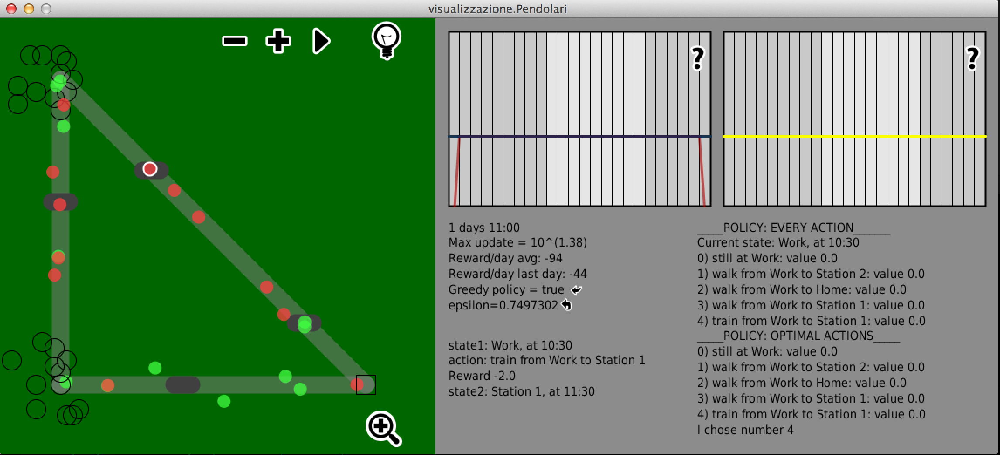
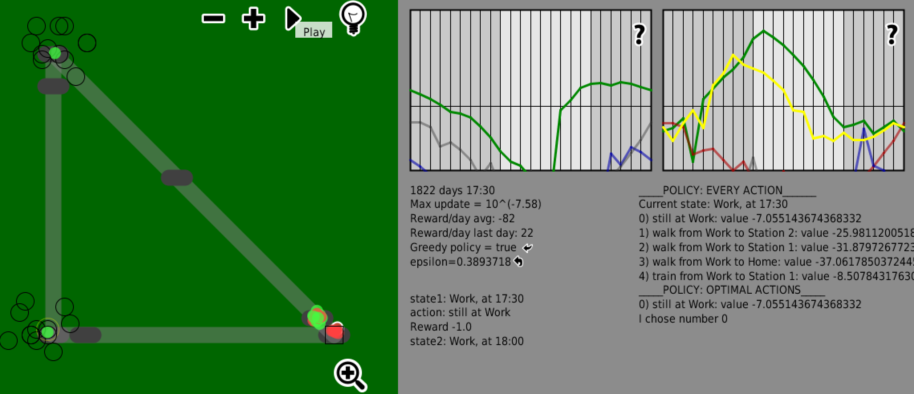
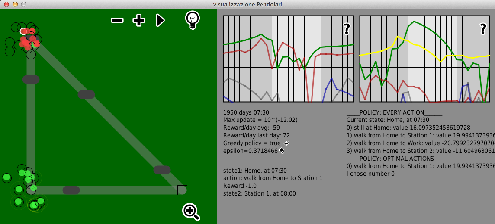
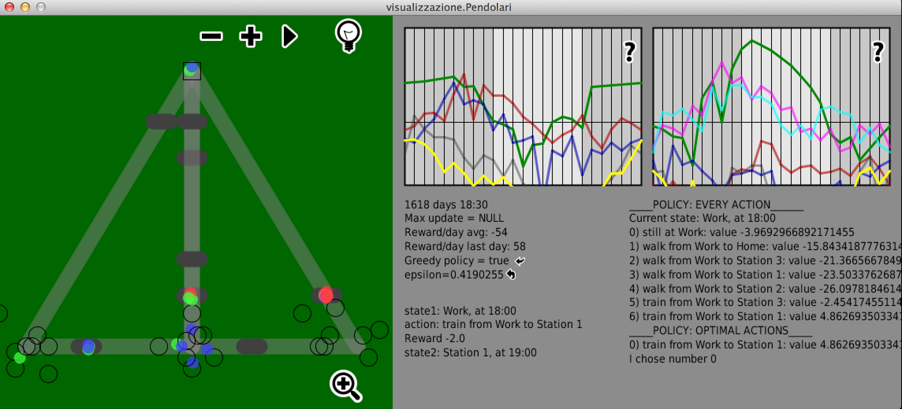

Commuters
=========

A reinforcement learning, agent based simulation
-------------------------

This is an application I realized in 2010 to simulate a group of commuters, which learn
their way through Reinforcement Learning.

To try it, you will find ready-made, stand-alone Mac, Linux and Windows app in the [Release section](https://github.com/corradomonti/commuters/releases/).

You can define your own environments (the agents will adapt) by changing the
file `commuters/map.txt`. You can find more examples in the `maps/` directory.

If you instead wish to build it from source, you can do so with `ivy` and `ant`,
like this:

    cd commuters
    ant ivy-setupjars
    ant
    . ./setcp.sh
    java visualizzazione.Pendolari
